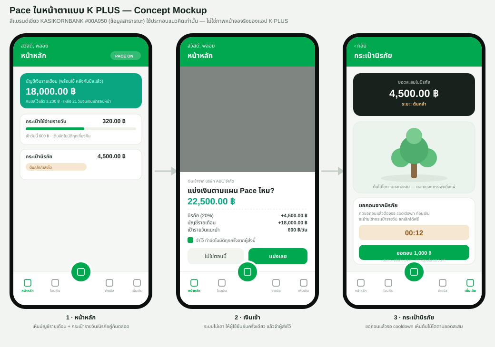
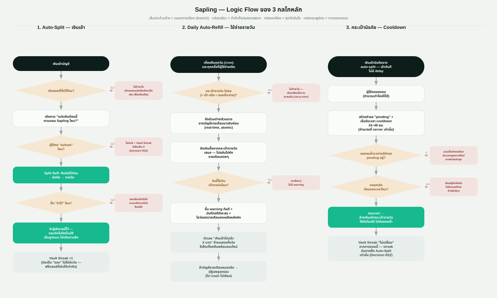

# Sapling — KBTG Kampus Hackathon 2026

> ระบบจัดสรรเงินอัตโนมัติบน K PLUS สำหรับ First Jobbers (22–30 ปี)
> **Track 1 — Software Engineering & Quality**

---

## ทีม

ชื่อทีม: **Three.py** — ใช้ตั้งชื่อไฟล์ส่ง `Three.py_1PagePitch.pdf`

| ชื่อ | บทบาท | รับผิดชอบ |
|---|---|---|
| Pornchanok Hongthong | Business Analyst | ฝั่ง business ของทั้งงาน — problem statement, คู่แข่ง, value proposition, pitch |
| Saifa Decha | Software Engineer | Sprint นี้: logic และ algorithm design |
| Wutthisak Boonkan | Software Engineer | Sprint นี้: logic และ algorithm design |

---

## ปัญหา

First Jobbers ไทยจำนวนมากเงินเดือนหมดก่อนสิ้นเดือนโดยไม่รู้ว่าเงินหายไปไหน ขณะที่กลุ่มอายุ 21–30 เป็นเหยื่อหลักของ scam ในไทย และเงินเดือนแรกเข้าส่วนใหญ่อยู่ที่ 15,001–30,000 บาท สวนทางกับค่าครองชีพในเมือง — ตัวเลขทุกตัวมี source อ้างอิงจริง ไม่ใช่การเดา (ดูหัวข้อ Research ด้านล่าง)

## แนวคิด

เงินเข้า → ระบบกันเงินบิลไว้ → แบ่งส่วนที่เหลือเข้า ePocket อัตโนมัติ → เติมกระเป๋าใช้จ่ายรายวันให้ทุกวัน → เงินออมอยู่ในกระเป๋าที่ถอนต้องรอ

### 3 กลไก

| กลไก | ทำอะไร |
|---|---|
| **Auto-Split** | เงินเข้า → เด้งถามยืนยัน → แบ่งเข้ากระเป๋าตามสัดส่วน (กันเงินบิลไว้ก่อน) · ติ๊ก "จำไว้" เพื่อทำอัตโนมัติรอบถัดไป |
| **Daily Auto-Refill** | เติมกระเป๋าใช้จ่ายรายวันทุกเที่ยงคืนจากบัญชีเงินรายเดือน · ใช้เกินได้ไม่บล็อก แต่เตือน + เก็บสถิติ |
| **กระเป๋านิรภัย** | บัญชีออมที่ถอนออกต้องรอ cooldown (ตั้งครั้งเดียวตอนเปิดบัญชี แก้ไม่ได้) |

**รองรับทั้งพนักงานประจำและฟรีแลนซ์** ด้วยกลไกเดียวกัน — ระบบไม่เดาว่าเงินก้อนไหนคือรายได้ แต่ให้ผู้ใช้ยืนยัน

---

## Demo Concept

Mockup ครบทั้ง 8 หน้าจอตามที่ปิด spec ไว้ใน `design_usecase.md` — แถวบนคือ flow หลัก (หน้าหลัก → ยืนยันเงินเข้า → กระเป๋านิรภัย) แถวล่างคือหน้าจอสนับสนุน (บิล / สถิติ / ตั้งค่า / ความเป็นส่วนตัว / Demo panel) โทนสีมืด/เขียวมิ้นท์และองค์ประกอบ (ไอคอนวงกลม, การ์ดขาวลอยบนพื้นเข้ม, ปุ่มสแกนกลางแถบล่าง) อ้างอิงจากภาพตัวอย่างแอป K PLUS จริงบน App Store **ไม่ใช่ภาพหน้าจอจริงของแอป — เป็น concept ที่ทีมออกแบบเอง**

### Logic Flow ของ 3 กลไกหลัก

แผนภาพขั้นตอนการตัดสินใจจริงของทั้ง 3 กลไก (เงื่อนไข/แขนงทางเลือกที่โค้ดต้องรองรับ) — ใช้ประกอบ pitch ตอนอธิบาย engineering logic และใช้เป็น reference ตรงกับ traceability table ใน `design_usecase.md`

### ต้นไม้ในกระเป๋านิรภัยโตตาม "ความสม่ำเสมอ" ไม่ใช่ตามยอดเงิน

ผูกกับยอดเงินแบบเดิมแล้วไม่แฟร์ — คนเงินเดือนสูงจะได้ต้นโตเร็วกว่าคนเงินเดือนน้อยโดยอัตโนมัติ ทั้งที่มีวินัยออมเท่ากัน จึงเปลี่ยนมาผูกกับ **Vault Streak**: จำนวนรอบเงินเข้าที่กดยืนยันแบ่งเงินเข้านิรภัย**ติดต่อกัน** (นับเป็นรอบ ไม่ใช่นับวัน — คนเงินเดือนน้อย/เยอะ หรือฟรีแลนซ์ที่รอบเงินเข้าไม่ตรงกัน นับเท่ากันหมด)

| Vault Streak (รอบติดต่อกัน) | ระยะต้นไม้ |
|---|---|
| 0 | ยังไม่ปลูก |
| 1 | หว่านเมล็ด |
| 3 | ต้นกล้า |
| 6 | ต้นเล็ก |
| 12 | ต้นโต |
| 24 | ใกล้เต็มต้น |
| ≥ 36 | เต็มต้น / ป่าเล็ก |

**ถอนเงินจากนิรภัยไม่ทำให้ streak ขาด** — สอดคล้องกับกติกาเดิมที่ว่า "ถอนได้เสมอ ไม่มีบทลงโทษ" streak ขาดเฉพาะตอนมีรอบเงินเข้าจริงแต่ผู้ใช้ไม่ยืนยันแบ่งเข้านิรภัยรอบนั้น เป็น visual/gamification ที่วัดพฤติกรรม ไม่กระทบ logic เงินหรือ cooldown — รายละเอียดเต็มดู Decision R22 (แก้ไขแล้ว) ใน [`decision_log.md`](docs/03-design/decision_log.md)

---

## เรื่องราวเบื้องหลัง — ทำไมถึงมาเป็น Sapling แบบนี้

หน้านี้ไม่ใช่แค่สรุปฟีเจอร์ แต่อยากเล่ากระบวนการคิดที่นำไปสู่ทุกการตัดสินใจ เพราะเกณฑ์ของโจทย์ตัดสินจาก **ความเข้าใจปัญหา + ความเหมาะสมของ solution + การประยุกต์ใช้ทักษะของ Track** — ไม่ใช่ความใหม่ระดับโลก ทีมจึงเลือกเดิมพันกับความรัดกุมของกระบวนการ ไม่ใช่ไอเดียที่ฟังดูหวือหวาแต่ตอบคำถามตามไม่ได้

### 1. เริ่มจากตัวเลข ไม่ใช่ความรู้สึก

ตั้งต้นด้วยสมมติฐานว่า "First Jobbers ไทยจัดการเงินไม่ทัน" แต่แทนที่จะเชื่อสมมติฐานเลย ทีมไล่หาตัวเลขจริงมายืนยันทุกจุด: Gen Z ไทย 63% และ Gen Y ไทย 64% ใช้เงินหมดพอดีทุกเดือน (Deloitte Global 2025) คนอายุ 21–30 เป็นกลุ่มเหยื่อ scam หลักของประเทศเฉลี่ย 12,956 บาทต่อคน (GASA/Nation Thailand) เงินเดือนแรกเข้าบัณฑิตจบใหม่ 25.6% อยู่ช่วง 15,001–30,000 บาท (JobsDB) และคนไทยกว่า 70% มีเงินสำรองฉุกเฉินไม่ถึง 3 เดือน (SCB EIC) ตัวเลข "84% เงินเดือนหมดเป็นศูนย์" ที่เคยใช้ในร่างแรกถูกตัดทิ้งทั้งหมดตอนหา source ไม่เจอ — กฎของทีมคือ **หา source ไม่เจอ = ตัดทิ้ง ไม่ใช่ปัดเศษให้ดูดี**

### 2. เจอความเสี่ยงที่สุดตั้งแต่ต้น: กรรมการคือเจ้าของผลิตภัณฑ์ที่เรากำลังจะไปเทียบ

จุดที่อันตรายที่สุดของไอเดียนี้ไม่ใช่คู่แข่งต่างประเทศ แต่คือ **K PLUS และ MAKE by KBank เป็นผลิตภัณฑ์ของ KBTG เอง** — กรรมการรู้จักดีกว่าทีมแน่นอน ทีมจึงไล่เช็คของเดิมทุกตัวก่อนพิชเพื่อไม่ให้โดนจับได้กลางเวที:

- **MAKE by KBank Cloud Pocket** มี lock เงินอยู่แล้ว แต่ **ปลดล็อกเองได้ทันที** ไม่มีหน่วงเวลา
- **K PLUS Lock Account** ล็อกได้จริง แต่เป็น **ล็อกทั้งบัญชีและต้องไปสาขาเพื่อปลด** (ยืนยันจาก KBank 1Q25 MD&A หน้า 31) — ทีมเกือบพลาดพูดว่า "K PLUS ยังไม่มีฟีเจอร์ล็อกเงิน" ซึ่งจะทำให้ดูเหมือนไม่รู้จักผลิตภัณฑ์ในเครือตัวเอง
- **K PLUS Schedule Transfer** ตั้งโอนล่วงหน้าได้อยู่แล้ว ต้องตอบให้ได้ว่า auto-split ต่างกันตรงไหน (ตอบ: ยิงตาม event เงินเข้า+ยืนยัน ไม่ใช่วันที่ตายตัว)
- **Qapital/Digit** ในต่างประเทศทำ auto-split-on-payday มาก่อนหลายปีแล้ว — ทีมเลิกพิชว่า "คิดค้นเป็นเจ้าแรกของโลก" แล้วเปลี่ยนเป็น "ยังไม่มีธนาคารไทยเจ้าไหนทำ + ผูกกับ ePocket เดิม"

ผลคือทีมสรุปได้ว่า **สิ่งที่ยังไม่มีใครทำจริงๆ เหลือ 3 อย่าง**: cooldown ที่ปลดเองในแอปได้แบบปล่อยอัตโนมัติ (ไม่ใช่ปลดทันทีแบบ MAKE และไม่ใช่ต้องไปสาขาแบบ Lock Account) · daily auto-refill ที่ดึงเงินข้ามกระเป๋าแบบ atomic พร้อมโชว์ผลกระทบยอดบัญชีหลักทันที · และการรวมทั้งหมดไว้ใน K PLUS ที่คนใช้อยู่แล้ว ไม่ใช่แอปแยก

### 3. ตัดของที่ซับซ้อนเกินความจำเป็นทิ้งเอง

ระหว่างออกแบบเคยมีไอเดีย "ยืมเงินจากอนาคตตัวเอง" (ยืมข้ามรอบเงินเดือน) แต่พอลองอธิบายให้คนนอกทีมฟังแล้วรู้สึกว่า logic แปลกและเข้าใจยากเกินไป ทีมตัดสินใจตัดออกทั้งหมดแทนที่จะฝืนใส่เพื่อให้ดูมีฟีเจอร์เยอะ — เลือกความเข้าใจง่ายของผู้ใช้มากกว่าความซับซ้อนที่ดูล้ำ

### 4. ปิดช่องโหว่อย่างเป็นระบบ ไม่ใช่แก้เฉพาะหน้า

แทนที่จะเขียน flow แล้วเริ่มโค้ดเลย ทีมไล่ตรวจทุก use case หาช่องโหว่ก่อน รอบแรกเจอ **49 จุด (G01–G49)** เช่น เงินเข้ารอบสองจะเกิดอะไรขึ้น, ขอถอนนิรภัยซ้ำระหว่างมีคำขอค้างอยู่ต้องทำยังไง, บิลอัตโนมัติที่หักตรงจะโดนกวาดเข้ากระเป๋าไปด้วยไหม ทุกข้อถูกปิดพร้อมเหตุผลใน `decision_log.md` และ `design_usecase.md` ไม่ใช่เดาเอาหน้างาน

จากนั้นทำ **รอบตรวจสอบที่สอง** เพื่อเช็คว่ากฎที่เพิ่งปิดไปขัดกับกฎเก่าที่มีอยู่ก่อนหน้าหรือเปล่า — เจอ interaction gap อีก 4 จุด (R15–R18) เช่น เงินตีกลับก่อนแบ่งจะต่างจากตีกลับหลังแบ่งยังไง หรือบิลที่ทยอยกันเงินแล้วยกเลิกกลางทางต้องคืนยอดสะสมทั้งหมดไม่ใช่แค่รอบล่าสุด — ระเบียบวินัยแบบนี้คือสิ่งที่ concept-only team ไม่มีเวลาทำ และเป็นสิ่งที่ track 1 (คุณภาพซอฟต์แวร์) ให้คะแนนตรงๆ

### 5. คิดต้นทุนฝั่งธนาคารไว้ล่วงหน้า ไม่ใช่แค่ฝั่งผู้ใช้

Sapling ทำให้ผู้ใช้ยินยอมลดสภาพคล่องตัวเองในกระเป๋านิรภัย ซึ่งงานวิจัย commitment device ชี้ว่าแม้ไม่มีอะไรตอบแทนเลยก็มีคนสมัครใจใช้ราว 28% (baseline ที่ยังต่ำไป ยังมีอีกเกือบ 72% ที่ยังไม่ยอมรับ) ทีมจึงเสนอ **ดอกเบี้ยพิเศษแบบมีเพดาน 50,000 บาทแรก** เพื่อดัน adoption ให้สูงกว่า baseline นี้ (≈ เงินสำรอง 2–3 เดือนของกลุ่มเป้าหมาย) โดยอ้างอิง precedent จาก MAKE by KBank เองที่ทำโมเดลคล้ายกัน — และเตรียมคำตอบเรื่องต้นทุน internal transfer (~30 ครั้ง/เดือน/คน) ไว้ล่วงหน้าว่าเป็น ledger entry ภายใน ไม่ใช่ธุรกรรมข้ามธนาคารจริง ต้นทุนต่ำกว่าที่ฟังดูตอนแรกมาก

### 6. ต้นไม้ในนิรภัยไม่ใช่แค่มุกตกแต่ง — ออกแบบให้สร้างความผูกพันกับเงินออม

หลังปิดเรื่องดอกเบี้ยพิเศษ (จูงใจเชิงตัวเลข) ทีมมองว่ายังขาด incentive เชิงความรู้สึกที่ทำให้ผู้ใช้ **อยากเปิดแอปมาดูนิรภัยของตัวเอง** ไม่ใช่แค่เห็นตัวเลขสะสมเฉยๆ จึงใส่ภาพต้นไม้ที่โตขึ้นตามยอดเงินจริง (แนวคิดเดียวกับแอป Forest ที่ทำให้คนไม่อยากขัดจังหวะต้นไม้ที่กำลังโต) — เห็น progress ที่จับต้องได้ทางสายตา ทำให้รู้สึกเป็นเจ้าของและลังเลที่จะถอนออกมากขึ้น โดยไม่มีการบล็อกหรือลงโทษใดๆ กดถอนได้เสมอ แค่ต้นจะเล็กลงตามจริงเท่านั้น

ระยะการโตผูกกับเกณฑ์ตัวเลขจริง (Decision R22) ไม่ใช่ค่าตกแต่งลอยๆ และจุดสูงสุด "เต็มต้น/ป่าเล็ก" ตรงกับเป้าเงินสำรอง 2–3 เดือนที่ใช้คำนวณเพดานดอกเบี้ยพอดี (R21) — ทำให้ทั้งสองกลไกเสริมกันเป็นเรื่องเดียว ไม่ใช่ฟีเจอร์แยกที่ไม่เกี่ยวข้องกัน และที่สำคัญคือ **เป็น UI ล้วนๆ ไม่มีต้นทุนเพิ่มฝั่งธนาคารเลย** ต่างจากดอกเบี้ยที่มีต้นทุนจริง

### 7. เขียนตารางกันตัวเองพูดเกินจริง

เพราะรู้ว่ากรรมการจับผิดง่ายที่สุดเวลาทีมพูดเกินสิ่งที่พิสูจน์ได้จริง ทีมทำตาราง **"Claims ที่ห้ามพูด"** ไว้เช็คก่อนขึ้นสไลด์ทุกครั้ง เช่น ห้ามพูดว่า "Sapling ป้องกัน scam ได้" (ความจริง: หน่วงเงินเพื่อการออม ผลพลอยได้คือมีเวลาคิดนานขึ้น ไม่มี risk engine) และห้ามพูดว่า "ระบบรู้เองว่าเงินก้อนไหนคือเงินเดือน" (ความจริง: ระบบไม่เดา ให้ผู้ใช้ยืนยันเสมอ)

---

## แผนคุณภาพ — จุดขายของ Track 1

Track 1 ตัดสินจาก Develop → Test → Ensure Quality ไม่ใช่แค่ไอเดียเฉยๆ แผนทดสอบจึงถูกออกแบบไว้ตั้งแต่ก่อนเขียนโค้ด:

- **Property test (จุดขายหลัก)** — สุ่มธุรกรรม 10,000 รายการผสมกันทุกแบบ (เงินเข้า/จ่าย/backfill/ขอถอน/ยกเลิก/cron เที่ยงคืน) แล้วยืนยันว่าผลรวมทุกกระเป๋าตรงกับยอดเงินรวมทุกครั้ง และไม่มีกระเป๋าไหนติดลบแม้ชั่วขณะ
- **Unit/Integration test** ครอบทุก edge case ที่ปิดไว้ใน G01–G49 และ R1–R18
- **Usability test 5–8 คนจริง** ตาม protocol ที่มี task, rubric และเกณฑ์ตัดสินเขียนไว้ล่วงหน้า พร้อม **pilot 1 คนก่อนเสมอ** ก่อนรันจริง
- **Security/Privacy checklist ตาม PDPA** เพราะ Sapling เก็บข้อมูลเงินเดือน บิล และพฤติกรรมใช้จ่าย ซึ่งเป็นข้อมูลส่วนบุคคลเต็มตัว

---

## Business Value — ผู้ใช้และธนาคารได้ประโยชน์ร่วมกัน

วิเคราะห์แบบ unit economics ต่อ 1 active user/เดือน แยกชัดว่าอันไหนคำนวณเป็นสูตรได้จริง อันไหนเป็นสมมติฐาน (รายละเอียดเต็มดู [`sapling_strategy.md`](docs/02-strategy/sapling_strategy.md))

| | ผู้ใช้ได้อะไร | ธนาคารได้อะไร |
|---|---|---|
| **มูลค่า** | ดอกเบี้ยพิเศษ + วินัยออมที่เพิ่มขึ้นจริง (อ้างอิง commitment-device research) + คืบหน้าสู่เป้าเงินสำรองฉุกเฉิน 3–6 เท่ารายจ่าย (SET) | CASA stickiness · engagement/cross-sell · retention ระยะยาวของกลุ่ม first jobber (สมมติฐาน ต้องพูดด้วยคำว่า "คาดว่า") |
| **ต้นทุน** | เสียสภาพคล่องชั่วคราว (cooldown 24–48 ชม.) | ดอกเบี้ยจ่ายเพิ่ม (สูตรคำนวณได้จริง ผูกเพดาน 50,000) + ต้นทุน ledger ภายใน (สมมติฐาน ต่ำเพราะไม่ใช่ transfer ข้ามธนาคาร) |

**แนวทางที่เสนอให้ทั้งสองฝั่งได้ประโยชน์สูงสุดพร้อมกัน:** ผูกดอกเบี้ยพิเศษกับ **ยอดเงินใหม่สุทธิ** (net-new balance เทียบ baseline ย้อนหลัง) แทนยอดคงเหลือดิบ — ธนาคารจ่ายดอกเบี้ยเฉพาะเงินออมที่โตจริง ไม่ใช่เงินที่ย้ายมาจากบัญชีเดิม (แก้ cannibalization risk, การันตี ROI บวก) ส่วนผู้ใช้ได้ narrative ชัดเจนขึ้นว่า "ออมเพิ่มยิ่งได้มาก" — **ยังไม่ตัดสินใจ** รอเทียบกับทางเลือกง่ายกว่าคือ bonus ครั้งเดียวตอนถึงเป้า 50,000 (K Point, ต้นทุน capped ชัดกว่าแต่แรงจูงใจต่อเนื่องอ่อนกว่า)

---

## สถานะตอนนี้ (13 ก.ย. 2026)

Logic ทางการเงินและ business rule ปิดครบแล้วทั้งหมด กำลังเข้าสู่ช่วง architecture (เลือก tech stack / ออกแบบ schema / API contract) ตามกำหนดการทางการของ KBTG:

| วันที่ | เหตุการณ์ |
|---|---|
| ถึง 21 Sep 2026 | ปิดรับ Applications — **ต้องส่ง 1-Page Pitch ภายในนี้** |
| 30 Sep 2026 | Candidate Announcement |
| 2 Oct 2026 | Orientation & Hackathon Kick-off |
| 3–29 Oct 2026 | Pitching Preparation Session — ช่วงทำ prototype จริง |
| 30 Oct 2026 | Final Slide Submission |
| 7 Nov 2026 | Pitching Day |

รายละเอียดสถานะงานทั้งหมดดูที่ [`docs/04-planning/BOARD.md`](docs/04-planning/BOARD.md)

---

## เอกสาร

| ไฟล์ | เนื้อหา |
|---|---|
| [`docs/01-brief/detail.md`](docs/01-brief/detail.md) | โจทย์และกติกาจาก KBTG — **ห้ามแก้ไข** |
| [`docs/02-strategy/sapling_strategy.md`](docs/02-strategy/sapling_strategy.md) | แผนงาน · วิเคราะห์คู่แข่ง · ช่องโหว่และการตัดสินใจทั้งหมด · References ทุกแหล่งข้อมูล |
| [`docs/03-design/design_usecase.md`](docs/03-design/design_usecase.md) | Use case 13 ข้อ + กลไกเรียนรู้บิล + flow + traceability สำหรับเขียนโค้ดและเทส |
| [`docs/03-design/decision_log.md`](docs/03-design/decision_log.md) | Decision log ล่าสุด (R1–R18) + warnings จุดเสี่ยงบัค + รายการที่ยังต้องถามก่อน design ต่อ |
| [`docs/04-planning/BOARD.md`](docs/04-planning/BOARD.md) | สถานะงาน + กำหนดการทางการ — เสร็จแล้ว / กำลังทำ / ยังไม่เริ่ม |
| [`docs/04-planning/AGILE_BACKLOG.md`](docs/04-planning/AGILE_BACKLOG.md) | Agile epics, user stories, priorities, dependencies, acceptance criteria และ sprint goals |
| [`docs/05-prototype/flow.svg`](docs/05-prototype/flow.svg) | ภาพ concept mockup 3 หน้าจอ (แสดงในหัวข้อ Demo Concept ด้านบนแล้ว) |
| [`docs/05-prototype/logic-flows.svg`](docs/05-prototype/logic-flows.svg) | Logic flow diagram ของ 3 กลไกหลัก (แสดงด้านบนแล้ว) |
| [`docs/06-pitch/Three.py_1PagePitch.pdf`](docs/06-pitch/Three.py_1PagePitch.pdf) | **1-Page Pitch ที่ใช้ส่งจริง** (PDF, 1 หน้า A4, ≤1MB) — แก้เนื้อหาได้ที่ source `docs/06-pitch/pitch.html` |
| [`archive/CLUADE.md`](archive/CLUADE.md) | บันทึกบริบทเดิม เก็บไว้อ้างอิงเท่านั้น |
